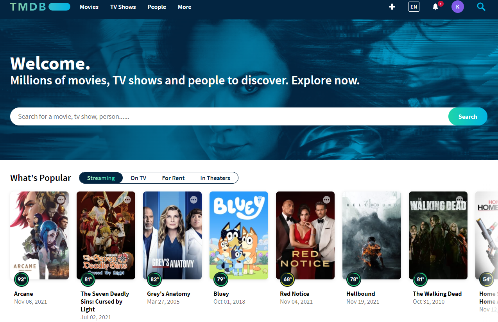

# TMDB - The Movie Database

Top rated movies and detailed information about films

## Architecture

- MVVM
- [Clean-Architecture](https://blog.cleancoder.com/uncle-bob/2012/08/13/the-clean-architecture.html)
- Use Case

## Technologies

- [Kotlin](https://kotlinlang.org/) - %100 Kotlin
- [Gradle Kotlin DSL](https://docs.gradle.org/current/userguide/kotlin_dsl.html)
- [Coroutines](https://github.com/Kotlin/kotlinx.coroutines) for asynchronous operations
- [StateFlow](https://kotlin.github.io/kotlinx.coroutines/kotlinx-coroutines-core/kotlinx.coroutines.flow/-state-flow/)
- [Lifecycle-ktx](https://developer.android.com/kotlin/ktx)
- [ViewModel](https://developer.android.com/topic/libraries/architecture/viewmodel)
- [Navigation](https://developer.android.com/guide/navigation)
- [View Binding](https://developer.android.com/topic/libraries/view-binding)
- [Dagger Hilt](https://developer.android.com/training/dependency-injection/hilt-android) for Dependency Injection
- [Retrofit](https://github.com/square/retrofit) for network operations
- [OkHttp](https://github.com/square/okhttp)
- [Coil](https://coil-kt.github.io/coil/) for image loading
- [TheMovieDb(Tmdb) Api](https://developers.themoviedb.org/3) for movies
